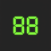
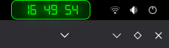

# Retro LCD 7-Segment Clock (V15).

[](https://ko-fi.com/retrolcdclock)

A GNOME Shell extension that adds a vintage-style digital clock to your panel. It features a high-fidelity 7-segment font (Digital-7) with fully customizable positioning (Left, Center, or Right), adjustable sizes, classic colors (Neon Green or Amber), and a realistic glow effect.

## Preview


## What's New in V15
- **Dynamic Positioning:** Users can now choose to place the clock on the **Left**, **Center**, or **Right** of the top panel.
- **Robust Reconstruction:** Improved internal logic that reconstructs the indicator on position changes to ensure stability and visibility.
- **Clean Package:** Removed unnecessary image files from the distribution package to comply with EGO Review Guidelines.
- **Extended Compatibility:** Full support for GNOME Shell versions **45, 46, 47, and 48**.

## Features
- **Realistic LCD Look:** High-fidelity `Digital-7` font with an adjustable glow effect.
- **Customizable:** Real-time adjustments for font size, glow intensity, and color themes (Neon Green / Amber).
- **Dynamic Date:** Click the clock to reveal the current date in the drop-down menu.
- **Modern Preferences:** Fully integrated with GNOME's LibAdwaita for a native settings experience.

## Installation

### From GNOME Extensions
The easiest way to install is via the [GNOME Extensions website](https://extensions.gnome.org/extension/6910/relojlcd/).

### Manual Installation (Pre-release Testing)
1. Clone this repository.
2. Copy the folder to `~/.local/share/gnome-shell/extensions/relojlcd@carlos`.
3. **Compile the schema** (Required for the new positioning feature):
```bash
glib-compile-schemas ~/.local/share/gnome-shell/extensions/relojlcd@carlos/schemas/

    Restart GNOME Shell (Alt+F2, type r and Enter on X11, or log out/in on Wayland).

Credits

    Developed by Carlos Corral.

    Uses the Digital-7 font by Sizenko Alexander (Style-7).

License

GPL-3.0
