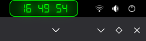

# 📟 Retro LCD 7-Segment Clock & Widget

GNOME Shell extension that displays a retro digital LCD-style clock in the top panel.

Minimalist, lightweight, and classic 7-segment design.

---

## 🚀 Recommended Installation

For the best experience, including automatic updates and seamless integration, it is highly recommended to install the extension through the official GNOME Extensions website:

👉 [Get it on GNOME Extensions](https://extensions.gnome.org/extension/9082/reloj-retro-lcd/)

---
---

## 📸 Preview



---

## ✨ Features

- 🖥️ 7-segment LCD style clock
- 🎨 Retro minimalist design
- 🔔 Alarm sound support
- ⚙️ Integrated preferences panel
- 🌙 Compatible with light and dark themes
- 🚀 Lightweight and optimized
- ✨ Flicker effect for authentic vintage LCD feel

---

## 📦 Super Easy Installation (Copy & Paste!)

### 🎯 Step 1: Download the extension
Open terminal (Ctrl+Alt+T) and paste this:

```bash
git clone https://gitlab.com/corral1976/gnome-shell-extension-relojlcd.git
cd gnome-shell-extension-relojlcd
```

Done! You've downloaded the extension 👈

---

### 🎨 Step 2: Install the font so it looks like a real clock
Paste this in the same terminal:

```bash
mkdir -p ~/.local/share/fonts
cp digital-7.ttf ~/.local/share/fonts/
fc-cache -f -v
```

Now your clock will look like a real LCD! 👈

---

### 🚀 Step 3: Install the extension automatically
Paste this magic command:

```bash
UUID=$(grep -Po '(?<="uuid": ")[^*]*' metadata.json)
DEST="$HOME/.local/share/gnome-shell/extensions/$UUID"
mkdir -p "$DEST"
cp -r * "$DEST/"
cd "$DEST"
glib-compile-schemas schemas
```

The extension is now installed! 👈

---

### 🔄 Step 4: Restart GNOME Shell
Choose one option:

**Option A - If you use X11:**
```bash
echo "Press Alt+F2, type 'r' and press Enter"
```

**Option B - If you use Wayland:**
```bash
echo "Log out and log back in"
```

---

### ✅ Step 5: Activate the extension
Paste this to open extensions:

```bash
gnome-extensions-app
```

Search for "Retro LCD" and turn on the switch 🎉

---

## 🎉 CONGRATULATIONS! 

You now have your retro LCD clock working 🎊

Not working? Restart your computer and you're all set.

---

## 🛠️ Requirements

- Compatible GNOME Shell
- gnome-extensions-app installed

---

## 📁 Structure

```
~/.local/share/gnome-shell/extensions/relojlcd@carlos/

relojlcd@carlos/
├── extension.js
├── metadata.json
├── prefs.js
├── stylesheet.css
├── digital-7.ttf
├── assets/alarm.ogg
└── schemas/
    ├── org.gnome.shell.extensions.relojlcd.gschema.xml
    └── gschemas.compiled  (auto-generated, don't version)
```

## ❤️ Support the project

If you like this extension and want to support its development:

### ☕ [Buy me a coffee on Ko-fi](https://ko-fi.com/retrolcdclock)

Your support helps maintain and improve the project.

---

## 📄 License

This project is distributed as free software.  
You can add your preferred license here (for example MIT or GPL).

---

## 📝 Credits

- **Digital-7 Font**: Created by **Sizenko Alexander** 2008 Style-7
- **License**: Free for personal use

Made with ❤️ by **Carlos Corral**
